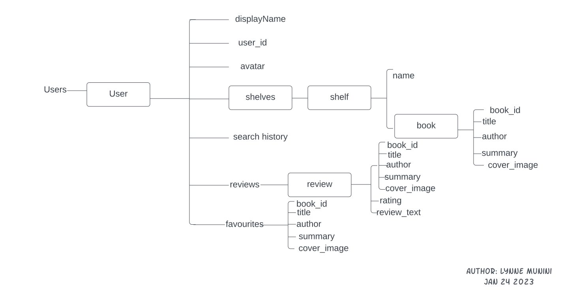

# BookShelf App

BookShelf is an Android app that allows users to search for books, view book details, leave reviews,
add books to favorites, and view example categories of books. The app uses Firestore, a No-SQL
database service provided by Google, to store user and book data.
The app also uses the Google Books API to search for books and retrieve book data.

### Bugs and Issues

Please note that the app is currently under development and bugs may be present. Bug reports and
suggestions are welcome. The app also requires active internet connection to function properly.

### Features
* Search for books using the Google Books API
* View book details, including the cover image, author, and description
* Leave reviews for books
* Add books to favorites for quick access later
* Browse example categories of books
* Authenticate using email/password or Google authentication
* Upload a profile image from the device gallery

### Future Features (not yet implemented):

| Feature | Description | Status |
| --- | --- | --- |
| Dark Mode | 🌑 Add a dark mode theme to the app | ✅ Completed |
| Book Recommendations | 📚 Add a feature that recommends books based on user preferences | ⏳ Not Started |
| Social Sharing | 🤝 Add a feature that allows users to share books with friends | ⏳ Not Started |
| Bookshelf | 📖 Add a feature that allows users to create their own bookshelves | ⏳ Not Started |
| Book Clubs | 📚👥 Add a feature that allows users to create book clubs | ⏳ Not Started |
| Notifications | 🔔 Add a feature that notifies users of new books, reviews, and other events | ⏳ Not Started |
| Multilingual Support | 🌐 Add support for multiple languages | ⏳ Not Started |
| Offline Mode | 📴 Add support for offline mode | ⏳ Not Started |

### Database

The app utilizes Firestore, a document-based database, which allows for more flexibility and
scalability in terms of data organization and querying.

### JSON Data

In order to help with understanding the data structure and organization of the app, a sample of the
JSON data used in the app is provided below

**JSON data structure**
<details>
<summary>Click to expand</summary>

```json
{
  "users": [
    {
      "displayName": "",
      "user_id": "",
      "avatar": "",
      "shelves": [
        {
          "name": "Reading",
          "books": [
            {
              "book_id": 1,
              "title": "",
              "author": "",
              "summary": "",
              "cover_image": ""
            },
            {
              "book_id": 2,
              "title": "",
              "author": "",
              "summary": "",
              "cover_image": ""
            }
          ]
        },
        {
          "name": "Have Read",
          "books": [
            {
              "book_id": 1,
              "title": "",
              "author": "",
              "summary": "",
              "cover_image": ""
            },
            {
              "book_id": 2,
              "title": "",
              "author": "",
              "summary": "",
              "cover_image": ""
            }
          ]
        },
        {
          "name": "To Read",
          "books": [
            {
              "book_id": 1,
              "title": "",
              "author": "",
              "summary": "",
              "cover_image": ""
            },
            {
              "book_id": 2,
              "title": "",
              "author": "",
              "summary": "",
              "cover_image": ""
            }
          ]
        }
      ],
      "search_history": [
        "book_id1",
        "book_id2"
      ],
      "reviews": [
        {
          "book": {
            "book_id": 1,
            "title": "",
            "author": "",
            "summary": "",
            "cover_image": ""
          },
          "rating": 4.5,
          "review_text": ""
        },
        {
          "book": {
            "book_id": 2,
            "title": "",
            "author": "",
            "summary": "",
            "cover image": ""
          },
          "rating": 4.5,
          "review_text": ""
        }
      ],
      "favourites": [
        {
          "book_id": 1,
          "title": "",
          "author": "",
          "summary": "",
          "cover_image": ""
        },
        {
          "book_id": 2,
          "title": "",
          "author": "",
          "summary": "",
          "cover_image": ""
        }
      ]
    }
  ]
}
```
</details>

**Diagram Representation of the JSON Data Structure**



### Authentication

The app uses Firebase Authentication to handle user authentication. The app uses email/password
authentication and Google authentication. 

### Technologies Used
Technologies Used:
* **Firebase:** The app utilizes Firebase's services, including Firebase Authentication, Firestore, and Firebase Analytics, to manage user authentication, store data, and track user behavior and usage.
* **Google Books API:** The app uses the Google Books API to search for books and retrieve book data.
* **Dagger-Hilt:** The app uses Dagger-Hilt, a dependency injection library, to manage dependencies and provide instances of objects throughout the app.
* **Kotlin Coroutines:** The app uses Kotlin Coroutines, a concurrency framework, to manage asynchronous operations and background tasks in a structured and organized way.
* **Retrofit:** The app uses Retrofit, a networking library, to make API requests and receive responses from external APIs.
* **GSON Converter:** The app uses GSON Converter, a data conversion library, to convert JSON data received from API responses into Kotlin objects for easier handling.
* **Coil:** The app uses Coil, an image loading and caching library, to load and display images in the app.
* **OkHttp:** The app uses OkHttp, a networking library, to handle HTTP requests and responses.
* **Preferences Datastore:** The app uses Preferences Datastore, a data storage library, to store user preferences and settings in a persistent and organized way.
* **LiveData:** The app uses LiveData, an Android Architecture Component, to handle data changes and updates in a lifecycle-aware way.
* **Jetpack Compose:** The app uses Jetpack Compose, a modern UI toolkit, to build the UI of the app.

### Installation
To install the app, clone the repository and open the project in Android Studio. The app can be run on an emulator or a physical device.

### Screenshots


### License
This project is licensed under the GNU GENERAL PUBLIC LICENSE - see the LICENSE file for details.

### Acknowledgements
* [Google Books API](https://developers.google.com/books)
* Dribbble - [E-Book Reader Design](https://dribbble.com/shots/18612908-E-Book-Reader-Mobile-App-Design)
* Dribbble - [Book Reading App Design](https://dribbble.com/shots/15046796-Books-reading-app)

### Contact
If you have any questions or suggestions, feel free to contact me on [Twitter](https://twitter.com/LynneMunini)
or [LinkedIn](https://www.linkedin.com/in/lynnemunini/).
You can also raise an issue on the repository.

### Contributing
Pull requests are welcome. For major changes, please open an issue first to discuss what you would like to change.

### Support
If you like the project, please consider supporting it by giving it a star ⭐️.